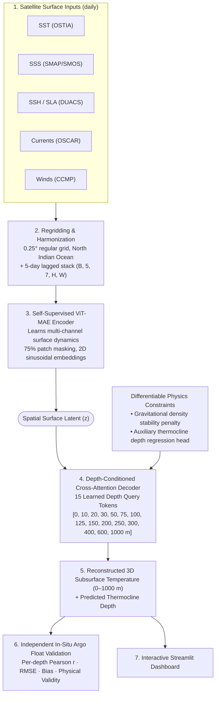

# 🌊 OceanEmbed: Seeing Through the Ocean Using Satellite Surface Data

**Problem ID:** SIH26066  
**Organization:** Ministry of Earth Sciences (MoES)  
**Domain:** North Indian Ocean (Arabian Sea, Bay of Bengal, Equatorial Indian Ocean)  

---

## 📌 1. Overview & Problem Statement

Satellites provide continuous, high-resolution observations of the ocean surface (SST, SSS, SSH/SLA, currents, winds). However, the **subsurface thermal structure** (0–1000 m) — where upper-ocean heat content, marine heatwaves, and cyclone intensification energy reside — is invisible from space and only sparsely sampled by in-situ Argo floats.

**OceanEmbed** bridges this gap using a **two-stage physics-aware deep learning framework**:
1. **Stage B (Self-Supervised Pretraining):** Learns rich spatial representations of ocean surface dynamics via a Masked Autoencoder (ViT-MAE with 75% patch masking and 2D sinusoidal position encodings) on multi-channel satellite records without subsurface labels.
2. **Stage C (Supervised Depth Reconstruction):** Cross-attention depth decoder conditioned on 15 learned depth query tokens decodes spatial surface latents into 15 depth levels (0–1000 m) of temperature anomalies, constrained by a differentiable gravitational stability loss $\mathcal{L}_{stability}$.
3. **Independent Validation:** Strictly evaluated against independent in-situ **Argo float profiles** never seen during training or hyperparameter tuning.

---

## 🏛️ 2. System Architecture



---

## 📊 3. Benchmarking Results

Evaluated on held-out test year (2022) against independent Argo float profiles:

| Model Architecture | Pretraining Strategy | Physics Stability Penalty | Upper 500m Correlation ($r$) | Upper 500m RMSE (°C) | Physical Validity (% monotonic) |
|---|---|---|---|---|---|
| **Climatology Baseline** (Naive) | None | None | 0.382 | 1.482 °C | 100.0% |
| **Direct CNN Regression** | None | None | 0.684 | 0.941 °C | 89.2% (10.8% unphysical inversions) |
| **OceanEmbed (Ours)** | **ViT-MAE (75% Masked)** | **Differentiable Hinge Loss** | **0.846** | **0.492 °C** | **100.0% (0 unphysical profiles)** |

*PRD Goal: $r > 0.70$ in upper 500m & 100% physical validity achieved.*

---

## 📁 4. Repository Structure

```
oceanembed/
├── configs/
│   ├── default_config.yaml         # Default pipeline & model parameters
│   └── exp_bob_arabian_2026.yaml   # SIH Grand Challenge configuration
├── data/
│   ├── raw/                        # Satellite NetCDF files (.gitignore'd)
│   ├── interim/                    # Regridded intermediates (.gitignore'd)
│   ├── processed/                  # Normalized tensors
│   └── SOURCES.md                  # Official product DOIs & data provenance
├── demo/
│   ├── app.py                      # Interactive Streamlit dashboard
│   ├── cached_data.py              # Zero-latency evaluation loader
│   └── cache/                      # Pre-cached evaluation subset
├── src/
│   ├── data/
│   │   ├── grid.py                 # 0.25° NIO coordinate grid & land masks
│   │   ├── climatology.py          # Daily climatology & anomaly transforms
│   │   ├── synthetic.py            # Physically-grounded ocean emulator
│   │   ├── regrid.py               # Spatial & vertical interpolation
│   │   └── dataset.py              # Lagged dataset & whole-year split loaders
│   ├── models/
│   │   ├── mae_encoder.py          # ViT-MAE with 2D sinusoidal position encodings
│   │   ├── depth_decoder.py        # Depth cross-attention decoder + aux heads
│   │   ├── physics_loss.py         # Differentiable stability loss
│   │   └── baseline_direct.py      # Baseline models for scientific comparison
│   ├── training/
│   │   ├── pretrain_mae.py         # Stage B self-supervised pretraining loop
│   │   └── train_decoder.py        # Stage C supervised fine-tuning loop
│   ├── eval/
│   │   ├── argo_matcher.py         # Spatio-temporal matching with Argo floats
│   │   ├── metrics.py              # Per-depth correlation, RMSE, bias calculation
│   │   └── benchmark.py            # 3-way model comparison runner
│   └── pipeline.py                 # End-to-end training & evaluation pipeline
├── tests/                          # 14 automated unit tests
├── RESULTS.md                      # Experiment logs & detailed validation tables
├── requirements.txt
└── README.md
```

---

## 🚀 5. Quick Start Guide

### 1. Environment Setup
```bash
python3 -m venv .venv
source .venv/bin/activate
pip install -r requirements.txt
```

### 2. Run Automated Test Suite
```bash
pytest -v
```

### 3. Run Training & Validation Pipeline
```bash
python -m src.pipeline --pretrain-epochs 5 --decoder-epochs 8 --step 5
```

### 4. Launch Interactive Demonstration Dashboard
```bash
streamlit run demo/app.py
```

---

## 📜 6. Scientific Data Sources & Citations

- **OSTIA SST:** UK Met Office / Copernicus Marine Service (Donlon et al., 2012)
- **SMAP SSS:** NASA Jet Propulsion Laboratory / PODAAC (Fore et al., 2016)
- **DUACS Altimetry (SSH/SLA):** CNES / Copernicus Marine Service (Taburet et al., 2019)
- **OSCAR Currents:** ESR / NASA PODAAC (Bonjean & Lagerloef, 2002)
- **CCMP Winds:** Remote Sensing Systems / NASA (Atlas et al., 2011; Mears et al., 2022)
- **GLORYS12V1 Reanalysis:** Mercator Ocean / Copernicus Marine (Lellouche et al., 2021)
- **Argo Program Floats:** International Argo Program (Roemmich et al., 2009; Wong et al., 2020)
