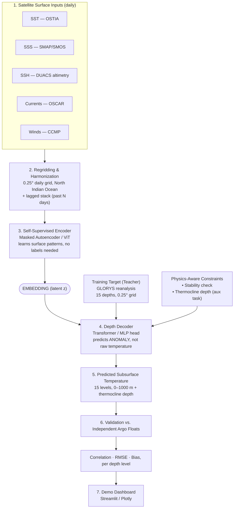

# OceanEmbed — Architecture

## 1. System Overview

OceanEmbed is a two-stage deep learning pipeline: a **self-supervised encoder**
learns a compact embedding of the ocean surface state, and a **supervised depth
decoder** maps that embedding to subsurface temperature anomalies at 15 depth
levels, constrained by physical plausibility checks.



## 2. Data Sources

| Variable | Product | Native resolution | Provider |
|---|---|---|---|
| Sea surface temperature | OSTIA | ~0.05°, daily | Copernicus Marine |
| Sea surface salinity | SMAP / SMOS | ~25–40 km, daily/8-day composite | NASA PODAAC / ESA |
| Sea level anomaly / SSH | DUACS altimetry | ~0.25°, daily | Copernicus Marine |
| Surface currents | OSCAR | ~0.25–1/3°, 5-day | NASA PODAAC |
| Winds | CCMP | ~0.25°, 6-hourly → daily-averaged | NASA/RSS |
| Training target (subsurface T) | GLORYS12V1 reanalysis | 1/12°, 50 levels, daily | Copernicus Marine (Mercator Ocean) |
| Independent validation | Argo float profiles | point observations | Argo GDAC (via `argopy`) |

All inputs are regridded to a **common 0.25° daily grid** before entering the model.

## 3. Pipeline Stages

### Stage A — Harmonization
- Reproject every source to 0.25° using conservative or bilinear regridding (xESMF/CDO)
- Stack into a single multi-channel tensor: `[SST, SSS, SSH, U, V, Wind-u, Wind-v] × lag_days`
- Compute and subtract climatology to work in **anomaly space** end-to-end

### Stage B — Self-Supervised Pretraining (no labels)
- Patchify surface maps (e.g. 16×16 patches)
- Randomly mask ~75% of patches (MAE-style)
- ViT encoder processes only visible patches → produces latent embedding
- Lightweight decoder reconstructs masked patches; loss is reconstruction MSE
- Trained on the **full long satellite record**, independent of GLORYS/Argo overlap, so it sees far more data than the labeled stage ever will

### Stage C — Supervised Fine-Tuning (with labels)
- Attach a depth-decoder head to the (frozen or fine-tuned) encoder
- Decoder takes `[embedding, depth-level query]` → predicts temperature anomaly at that depth
- Trained against GLORYS anomaly targets across all 15 depth levels simultaneously (multi-head or depth-conditioned single head)
- Auxiliary loss: thermocline depth regression
- Auxiliary loss: stability/monotonicity penalty on the predicted profile
- Temporal train/test split: **entire years held out**, never mixed across the split, to prevent seasonal leakage

### Stage D — Validation
- Evaluate exclusively against **Argo profiles never used in training**
- Metrics computed **per depth level**: Pearson correlation, RMSE, bias
- Report separately for Bay of Bengal vs. Arabian Sea sub-regions given differing Argo density

### Stage E — Demo
- Interactive dashboard: pick a date/location → show satellite surface inputs → show predicted vs. GLORYS/Argo actual profile → show skill scores

## 4. Model Architecture Detail

```
Input tensor:  (B, T_lag, C, H, W)
                 C = 7 channels (SST, SSS, SSH, U, V, Wind-u, Wind-v)

Patch Embed:   Conv2d/Linear projection → (B, N_patches, D)
Encoder:       ViT blocks (self-attention + MLP), operates on visible patches only during pretraining
Embedding:     (B, D) or (B, N_patches, D) pooled latent

Depth Decoder: Cross-attention or MLP conditioned on a learned depth-level
               positional embedding (15 discrete depth tokens: 0, 25, 50, ... 1000 m)
Output head:   Linear → scalar temperature anomaly per (lat, lon, depth)
Aux head 1:    Linear → thermocline depth (scalar per lat/lon)
Aux head 2:    Stability regularizer on d(density)/d(depth) computed from
               predicted T (and climatological salinity) via GSW-Python
```

### Loss function

```
L_total = L_reconstruction (pretraining only)
        + λ1 · L_temperature_anomaly (MSE/MAE per depth)
        + λ2 · L_thermocline (MSE)
        + λ3 · L_stability (penalize non-monotonic density profile)
```

## 5. Tech Stack

| Layer | Tools |
|---|---|
| Data acquisition | `copernicusmarine`, `podaac-data-subscriber`, `argopy` |
| Data handling | `xarray`, `netCDF4`, `Dask`, `NumPy`, `Pandas` |
| Regridding | `xESMF`, `CDO` |
| Modeling | `PyTorch`, `PyTorch Lightning`, `timm`/`einops` |
| Physics | `GSW-Python` (Gibbs SeaWater), custom loss functions |
| Evaluation | `xskillscore`, `scikit-learn` |
| Demo | `Streamlit`, `Plotly`, `Matplotlib` + `Cartopy` |
| Compute | Google Colab Pro / Kaggle Notebooks (T4/A100-class GPU) |

## 6. Deployment / Demo Architecture (PoC)

```
[Pretrained model checkpoint] → [Streamlit app]
        ↑                              ↓
[Cached GLORYS + Argo subset]   [User selects date/region]
                                        ↓
                          [Model inference → predicted profile]
                                        ↓
                    [Plot: predicted vs. GLORYS vs. Argo + skill scores]
```

No live satellite ingestion is required for the demo — a cached subset of
pre-processed inputs is sufficient for a hackathon PoC.
